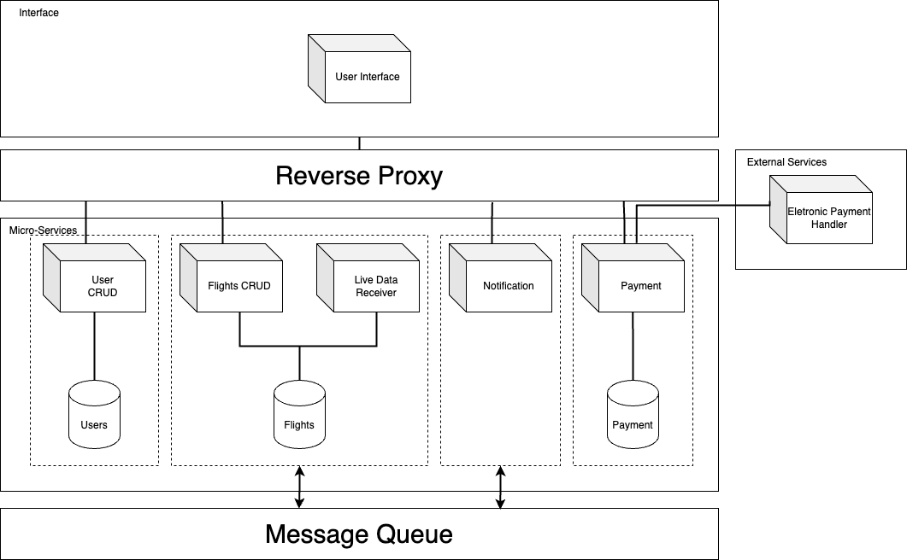

# GATEMATE

Nota: 15

## Abstract
GateMate is a flight booking and management platform designed to simplify and enhance the travel experience for users utilizing air travel services. It will be used by travelers to perform various flight-related operations, such as ticket booking, online check-in, and accessing real-time flight information.

The high-level problem our system aims to solve is the complexity and lack of convenience often associated with air travel. Currently, travelers frequently need to deal with multiple websites and apps from different airlines to make their reservations, check in, and obtain information about their flights. This can be confusing and time-consuming, resulting in a frustrating travel experience.

"GateMate" was conceived to address this problem by offering a comprehensive and centralized solution for all users' flight booking and management needs. With an intuitive and user-friendly interface, travelers can complete all necessary steps before their trip, from booking tickets to checking in and accessing updated information about their flights, all in one place.

Initially, we planned to include extensive integration with various airlines, providing users with a wide range of flight options. However, due to the complexity and challenges associated with this approach, we decided to focus on a few major airlines for the initial launch of the system, with plans to expand and include more airlines in the future.

This system differentiates itself from similar products through its integrated, user-centric approach. By consolidating all flight-related functionalities into a single platform, "GateMate" offers users a more convenient and efficient experience, making air travel more accessible and enjoyable.


## Architecture
## 


## How to run

cd into the root directory and run the following commands:

```bash
git pull
git submodule update --init --recursive --remote
cd GateMate
```
Read the README.md file in the root directory for more information.

## Bookmarks
The documentation for this project is available at the docs folder.

## Important Links
- [Project Repository](https://github.com/GateMate-TQS/Projeto-TQS)
- [Project Management](https://ua-team-uuqqbcie.atlassian.net/jira/software/projects/SCRUM/boards/1)
- [SonarCloud](https://sonarcloud.io/projects?_gl=1*8x438f*_gcl_au*MTUzMDI0MDc4NS4xNzE2NDEwODI3*_ga*NTAwMzQ4ODkuMTcxNjQxMDgyNw..*_ga_9JZ0GZ5TC6*MTcxNzU4Nzk2NC4yLjAuMTcxNzU4Nzk2NC42MC4wLjA.)
- [Aviation Stack API](https://aviationstack.com/)

## Autores

| NMec | Name | Email | Roles |
|--:|---|---|---|
| 107637| André Oliveira| andreaoliveira@ua.pt| Team Manager |
| 107359| Duarte Cruz | duarteccruz@ua.pt | DevOps |
| 108624| Tomás Matos | tomas.matos@ua.pt| Product Owner |
| 108902| Diogo Almeida | almeidadiogo03@ua.pt | QA Engineer |
